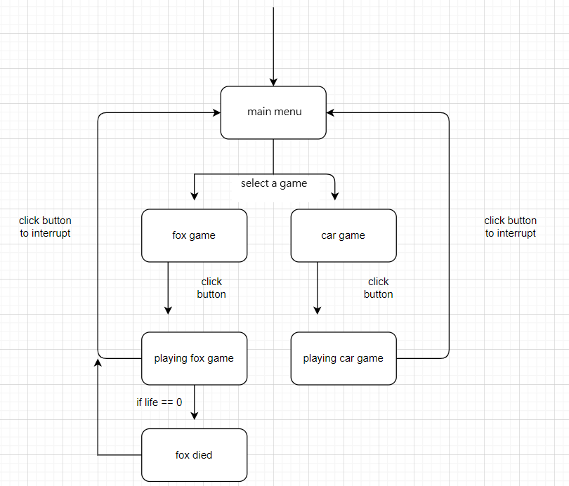
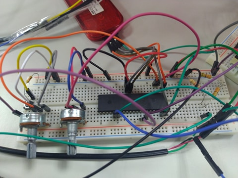
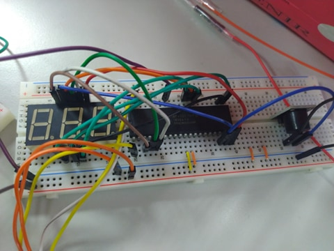
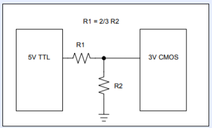
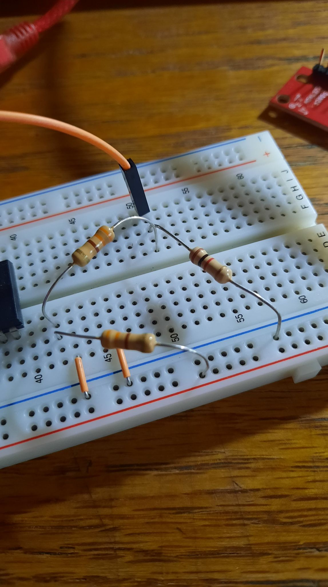

# Micro Dino
MCU2020 - Team 11  
Team Members: [Jason Lin], [Rex Huang], [Jack Lin], [Ming-Chi Cheng]

## System Overview

The system primarily offers these functionalities:
- One is a game based on hand motion detection, using an accelerometer to measure hand movements.
- The other simulates a driving scenario using two variable resistors: one to control direction and the other to control acceleration, striving to replicate realistic conditions. This aims to create a realistic experience, utilizing Unity to simulate friction, wheel control, and other dynamics.
- An additional feature is using `timer0` to control a three-digit seven-segment display and a buzzer.

## Target Users and Scenarios

Our design is intended for people who dislike exercising but enjoy playing games. In modern society, people are becoming increasingly lazy, with even going out to shop becoming a difficult choice. These games aim to bring joy to people while also encouraging them to do hand exercises.

Additionally, we simulate a driving scenario, allowing those who don't like going out to enjoy the fun of driving and appreciate outdoor scenery. We hope this can help reduce the number of dangerous drivers on the road.

## System Architecture

### Gaming Flow

### Circuit

MCU1 (For communicating to Unity, and sensor, button, Variable Resistor connection):

MCU2 (For Buzzer, Seven-segment display connection):

DC to DC step-down converter (5V to 3V):

## Tech Stacks
### Hardware Components
- Accelerometer (ADXL335)
- Three-digit seven-segment display (C-563G-12)
- Button
- variable resistors \* 2
- Buzzer

### Frameworks
- Unity
- C# Libraries: System.IO.Ports.SerialPort, Unity2D
- MPLAB: C, Assembly
- Pickit

## Team Member Responsibilities
- **Unity Game Development** - Responsible for creating and managing the game environment, interactions, and overall design using Unity: [Ming-Chi Cheng], [Rex Huang].
- **Control between MCU and Unity**: Manages the connection between the microcontroller unit (MCU) and Unity, and handles the integration of variable resistors and buttons: [Jack Lin].
- **Accelerometer**: Responsible for integrating and calibrating the accelerometer (ADXL335) for detecting hand movements: [Jason Lin], [Rex Huang].
- **7-Segment Display**: [Jason Lin].
- Timer: [Ming-Chi Cheng].

## Challenges Encountered and Solutions

**Issue**: The accelerometer and Pickit couldn't establish an SPI connection, and one accelerometer was damaged during a test.

**Solution**: We purchased a different accelerometer that does not use the SPI interface and switched to using ADC to read the accelerometer values.

---

**Issue**: The datasheet for the 3-digit 7-segment display was not available.

**Solution**: [Jason Lin] found the datasheet for a similar model, studied the pin configuration, and deduced the operating mode. We confirmed that the display uses a common cathode configuration, allowing us to successfully implement the timer.

---

**Issue**: The accelerometer was not well-soldered, leading to unstable connections and disconnections during movement.

**Solution**: We borrowed a soldering iron from the laboratory and soldered the accelerometer ourselves.

---

**Issue**: There were not enough PIC18 pins to connect the 7-segment display and other components.

**Solution**: We used a second PIC18 to connect the 7-segment display.

---

**Issue**: The 2 PIC18s could not communicate with each other.

**Solution**: This was a voltage issue. Since the USB power supply voltage ensures proper 5V only when using the same laptop, we couldn’t guarantee equal voltage on both PIC18s when using two separate laptops. Therefore, we disconnected the power supply from one PIC18 and connected it in series with the power supply of the other PIC18. Only one power supply could be used.

---

**Issue**: UART communication occasionally failed.

**Solution**: Restarted MPLAB.

## Skills Used for PIC18 MCU

- Interrupt
  + Button
- Timer
  + Dino Game score counter (7-segment display)
  + Buzzer sounds
- UART
  + Transmission between Pickit and computer
- ADC
  + Variable resistors controlling car direction and main menu buttons
  + Accelerometer
  + Menu control

## Additional Skills Used in the Project

- Algorithm
  + Regarding to calculations on the Pickit, we avoided using multiplication and instead relied on simple operations or basic left and right shifts.
  + Friction is simulated using the values from the variable resistors rather than utilizing Unity's game engine for simulation.
- Game Design
  + Unity is used for intensive computations, such as ray tracing and rendering.
- Innovation
  + Simulated driving scenarios using a wheel object for movement to enhance realism, and two variable resistors to mimic driving conditions: one as a steering wheel and the other as a brake pedal.
  + Used the accelerometer to control the game character's jumping and crouching actions, blending novelty with physical activity.
  + Menu selection is handled using variable resistors and buttons.
- Integration
  + On the main program’s breadboard, we connected two variable resistors and one button, and linked RB0 to another breadboard with a seven-segment display and buzzer, connecting AN2 as well.
  + Integrated four functionalities taught in class, distributed across two different PIC18s, and enabled communication between them.

[Jason Lin]: https://github.com/SmallHanley
[Rex Huang]: https://github.com/shangrex
[Jack Lin]: https://github.com/blueskyson
[Ming-Chi Cheng]: https://github.com/teimeikichengmingchi