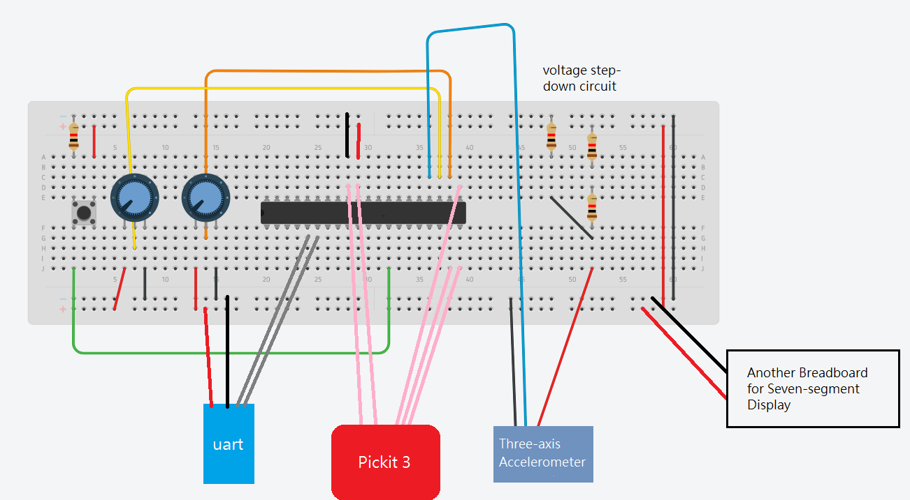
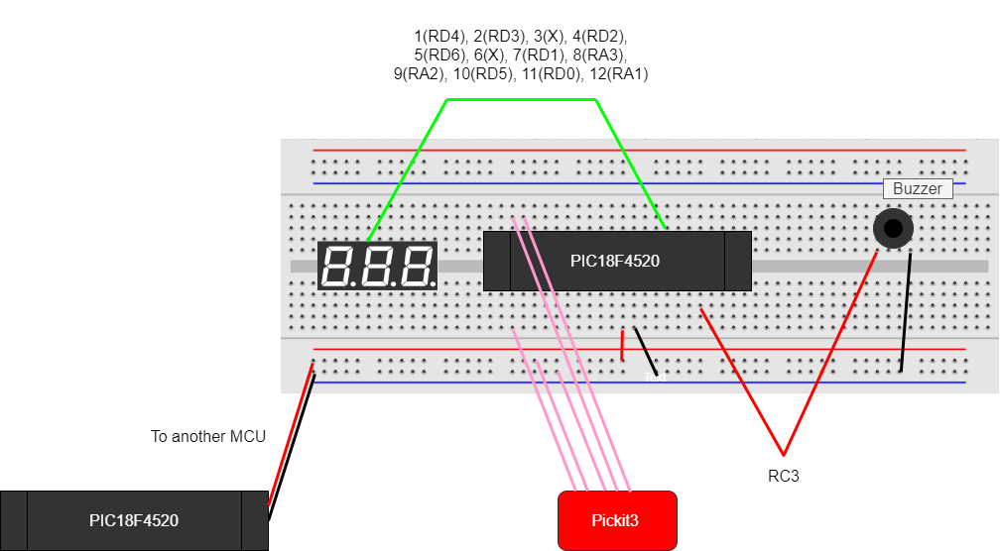
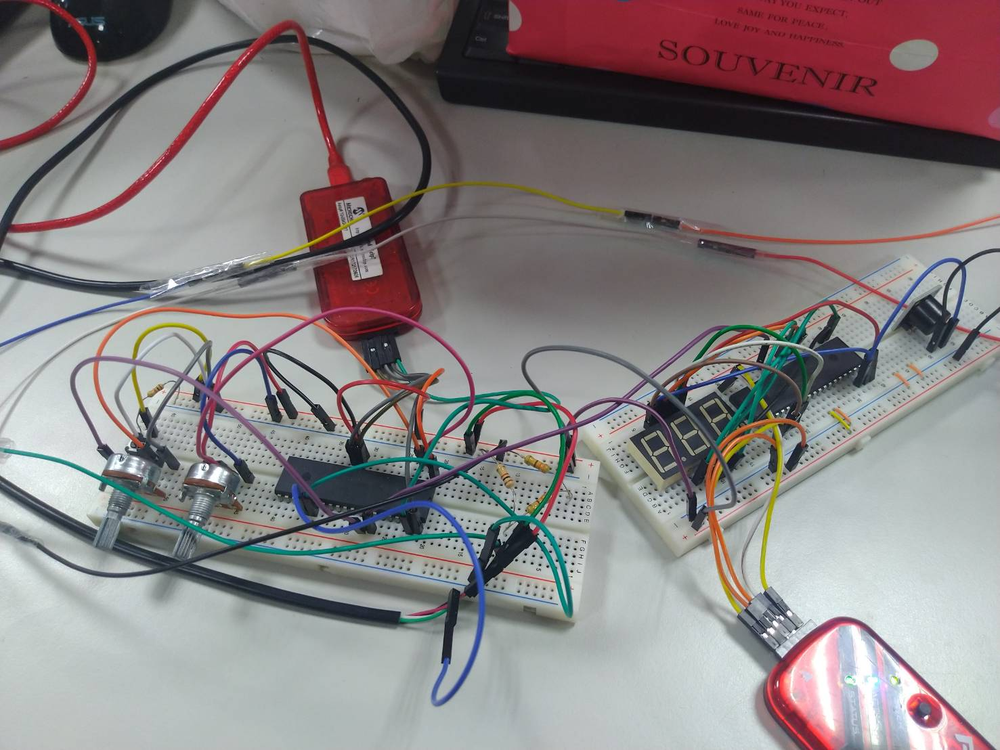

# Micro_Dino

A dino game and a car driving game implemented by PIC18F4520 microprocessor &amp; Unity.

Document (zh_TW) on [HackMD](https://hackmd.io/IWLPYfTdRyKPHUGnx8ddHg?fbclid=IwAR0cXn7buBysuYhh0P-jmmP9dwj5dhk9y3kZmYLS2ussdyaId8vDYALRhKg).

## Circuit

Breadboard for three-axis accelerometer (ADXL335), variable resistors, button, and uart.

Breadboard for seven-segment display (C-563G-12) and buzzer.

Real picture of the circuit.

## Demo

Play dino game by three-axis accelerometer.

Play car driving game by two variable resistors, one as accelerator, the other as steering wheel.

